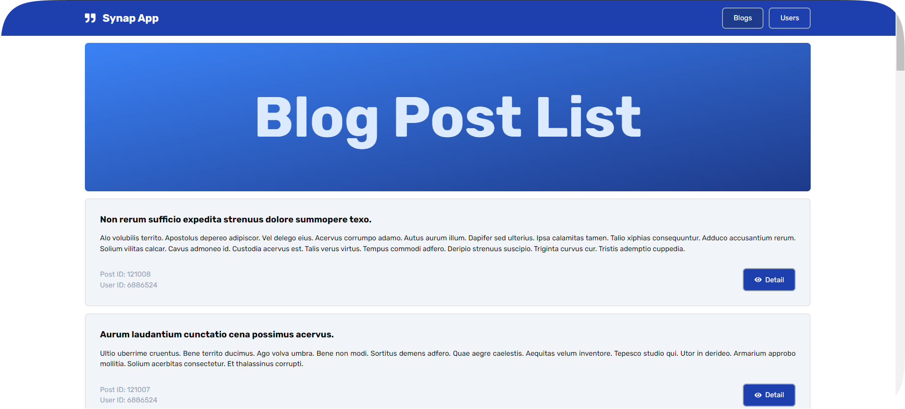

# Synap App



This [Next.js](https://nextjs.org/) project was created as part of a challenge test for the recruitment stage as a Front End Developer Intern at PT Synapsis Sinergi Digital.

## Features

1. public api from https://gorest.co.in/ to generate a blog post.
2. Blog post list
3. Blog post detail with comment and user
4. Users page with Create, Read, Update, Delete and Search users

## How to Run Project

First, install axios to fetch data request:

```bash
npm install axios
# or
yarn add axios
```

Second, install font-awesome icon:

```bash
npm install react-icons --save
```

Third, run the development server:

```bash
npm run dev
# or
yarn dev

Open [http://localhost:3000](http://localhost:3000) with your browser to see the result.
```
